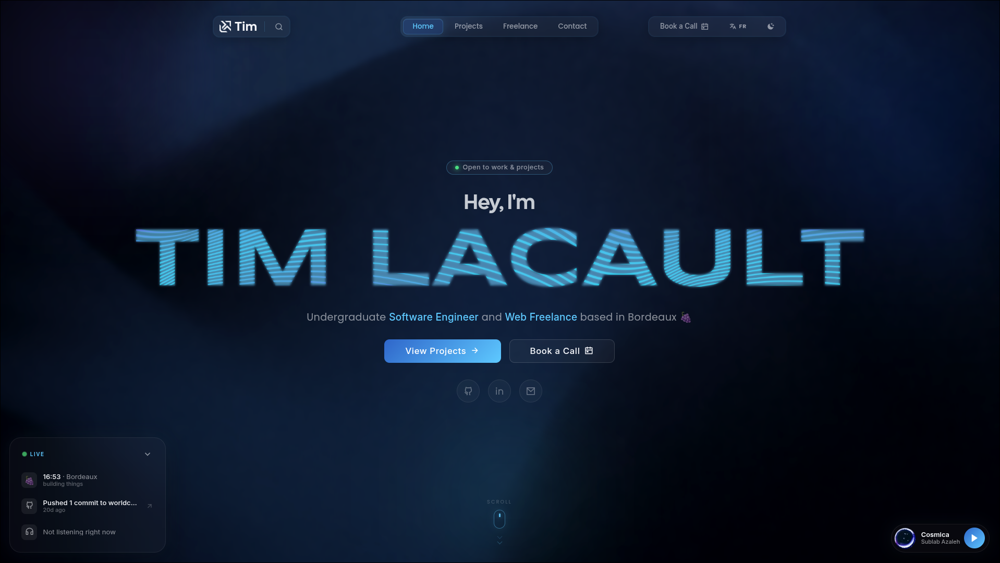

<div align="center">

# timlacault.dev

**Personal developer portfolio — hand-crafted with Vue 3, from pixel to deploy.**

[](https://timlacault.dev)
[](https://vuejs.org/)
[](./LICENSE)

<br/>



</div>

<br/>

## About

This portfolio showcases my work as a software engineer and freelance web developer: selected projects, freelance services, my resume, and a few interactive details along the way. It's also a playground where I experiment with UI/UX ideas outside of client work.

## Features

| | |
|---|---|
| 🖱️ **Interactive hero** | Smooth-scrolling landing experience powered by [Lenis](https://github.com/darkroomengineering/lenis) |
| 🗂️ **Project showcase** | Dedicated case studies (DevShell, FlowBoard, NetScan, and this portfolio itself) |
| 💼 **Freelance section** | Services, process, numbers, and testimonials for freelance/consulting inquiries |
| ⌘ **Command palette** | `⌘K`-style fast keyboard navigation |
| 🟢 **Presence widget** | Real-time status indicator |
| 📻 **Radio player** | Embedded, ambient background listening |
| 🤖 **Chatbot** | Answers visitor questions on the fly |
| 🌍 **Bilingual** | Full French / English i18n |
| ✉️ **Contact** | EmailJS-powered contact form |

## Tech Stack

<div>


</div>

## Getting Started

```bash
# Install dependencies
npm install

# Compile and hot-reload for development
npm run serve

# Compile and minify for production
npm run build

# Lint and fix files
npm run lint
```

See the [Vue CLI Configuration Reference](https://cli.vuejs.org/config/) for build customization.

## License

<div align="center">

MIT © [Tim Lacault](https://timlacault.dev)

</div>
